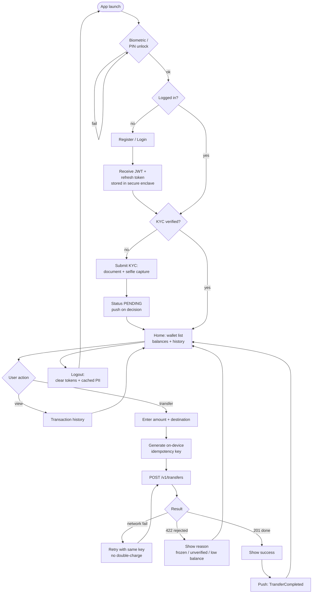
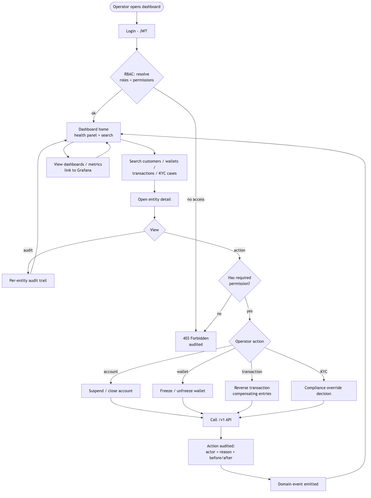
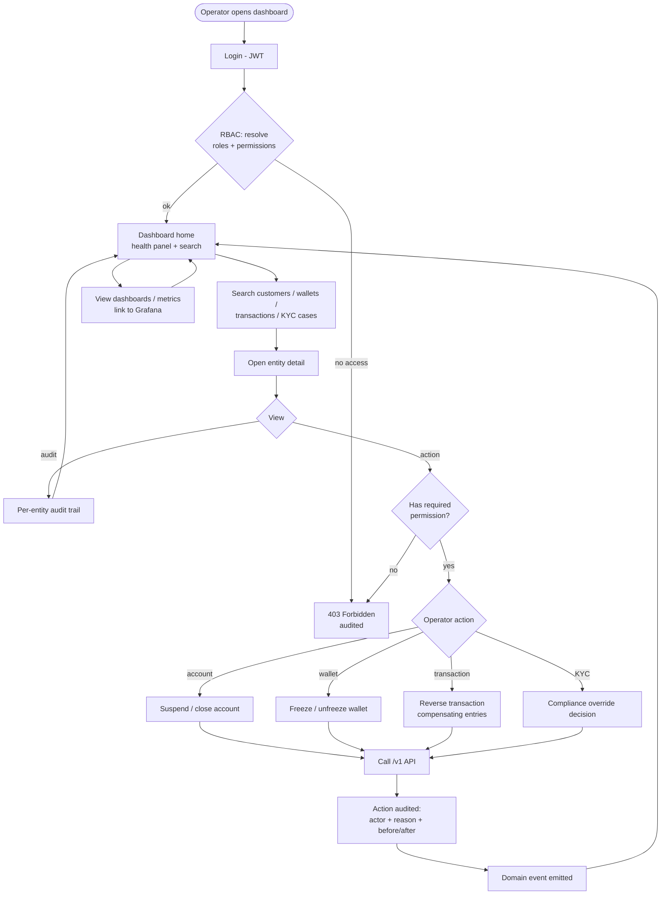
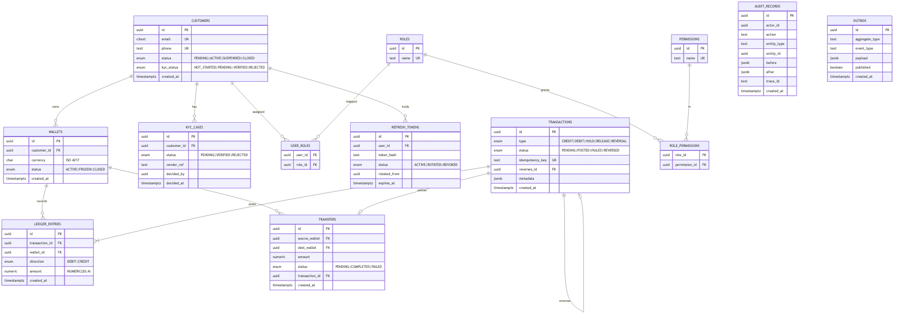
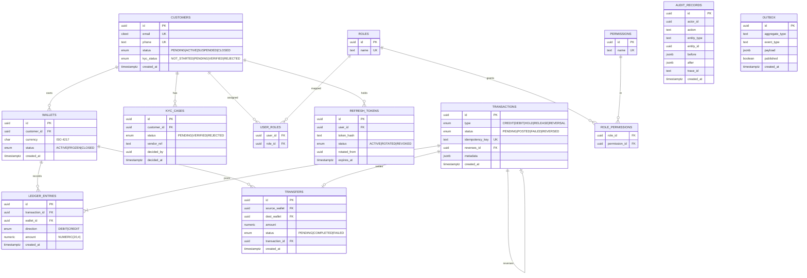

# Diagrams

> Digital Banking Platform · ERD + Mobile & Dashboard Flows
> Rendered images live in `diagrams/`. Mermaid source kept below each image.

To re-render after editing any `.mmd`:
```
npx -y @mermaid-js/mermaid-cli -i diagrams/src/erd.mmd -o diagrams/erd.png -b white -s 2
```

---

## A. Mobile App Flow

End-user journey through the React Native app — unlock, onboarding, KYC, wallets, and
the transfer flow with on-device idempotency.


<details><summary>Mermaid source</summary>


</details>

---

## B. Admin Dashboard Flow

Operator journey through the React console — RBAC-gated search, entity views,
and audited operator actions.



<details><summary>Mermaid source</summary>


</details>

---

## C. Entity Relationship Diagram (ERD)



<details><summary>Mermaid source</summary>


</details>

> `AUDIT_RECORDS` and `OUTBOX` are intentionally not foreign-keyed to business
> tables — audit is append-only across all entities, and the outbox is a generic
> event buffer. Both reference entities by id/type rather than hard FKs.
